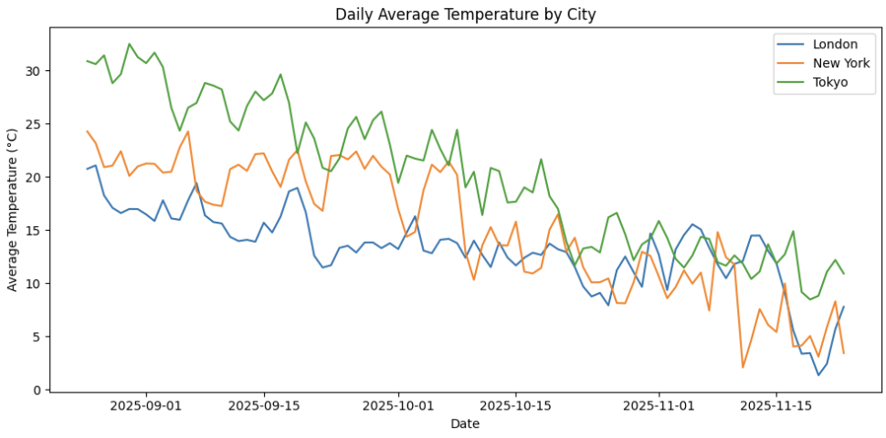
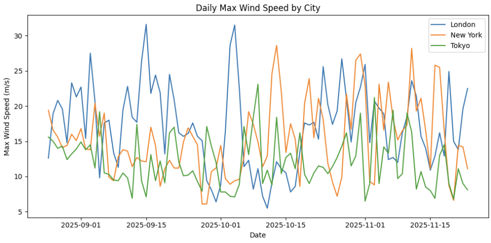
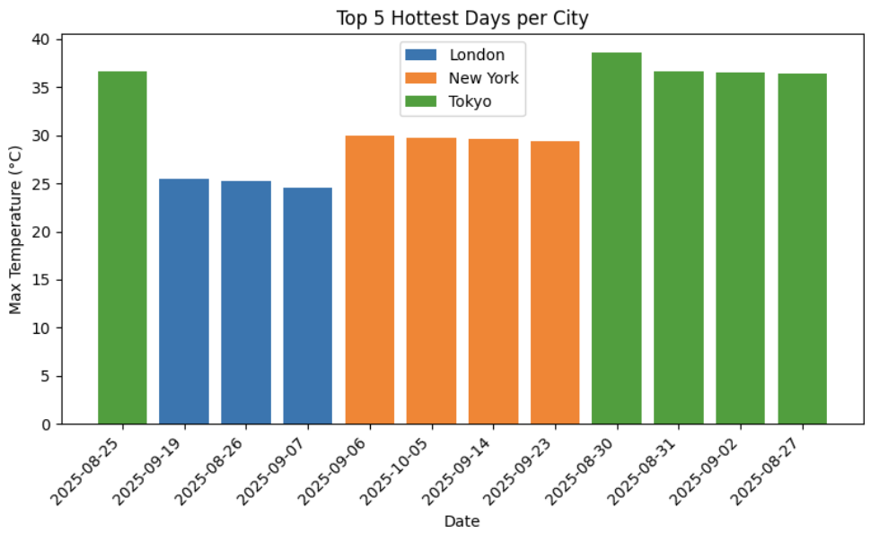

### 🌦️ Weather Streaming Pipeline

Real-time data engineering project using Kafka, Spark Structured Streaming, Delta Lake (MinIO), Cassandra, and Grafana
Built fully with Docker Compose


### ⭐ Project Overview 
This project demonstrates a real-time end-to-end data streaming pipeline, built exactly like a modern production data engineering system. It ingests live weather data from the Open-Meteo REST API, streams it through Kafka, processes it using Spark Structured Streaming, lands it into a Delta Lakehouse on MinIO, and serves the latest metrics from Cassandra, visualized in Grafana.
The goal is to show real Data Engineering skills across:
- Real-time ingestion
- Stream processing & ETL
- Lakehouse architecture
- Serving layer with Cassandra
- Analytics dashboard
- Infrastructure-as-code with Docker Compose
- Delta Lake (ACID + time travel)
This pipeline can be extended later with Kubernetes, Airflow orchestration, and Prometheus alerting.

### Pipeline Architecture:


### ✨ Features
✔ Real-time ingestion
- The producer polls Open-Meteo API every 30 seconds and streams JSON into Kafka.

✔ Delta Lakehouse on MinIO
Spark writes Bronze, Silver, and Gold Delta tables with:
- ACID transactions
- Versioning / Time Travel
- Schema enforcement
- Open format (Parquet + transaction log)

✔ Serving layer with Cassandra
- Spark writes only the latest weather observation per city into Cassandra.
- Grafana reads directly from Cassandra for low-latency dashboards.

✔ Jupyter Notebooks for analytics
- You can explore bronze/silver data using PySpark or Pandas.

✔ Fully containerized
- Every component runs in a Dockerized environment.

### 🏗️ How to Run the Pipeline (Docker Compose)

1. Clone the repo
```bash
git clone https://github.com/<your-username>/weather-streaming-pipeline.git
cd weather-streaming-pipeline
```
2. Before starting the pipeline, you must download the required JAR dependencies
- All jars are located in file "requirements_jars.txt"
   
4. Start all services
```bash
docker-compose up --build
```

4. View data arriving
Kafka topic:
```bash
docker exec -it kafka kafka-console-consumer --bootstrap-server kafka:9092 --topic weather --from-beginning
```

MinIO (Delta tables):
Bronze table is stored in:
```bash
minio/data/weather-data/bronze/
```

Cassandra:
```bash
SELECT * FROM weather.readings;
```

### 📊 Dashboard (Grafana)

The dashboard shows:
- Temperature gauge


### 🔧 Spark Jobs Included
1. spark_consumer.py: Real-time stream processing from Kafka → MinIO (Delta Bronze) & Cassandra.
2. weather_bronze_to_silver.py: Batch transformation notebook → clean & flatten Bronze → Silver.
3. weather_silver_to_gold.py: Aggregations → Gold business tables.
4. spark_historical_bf.py: Backfill job for historical reprocessing.

### Visualization
Below are some historical analysis visualization that generated in Jupyter notebook reading data from Lakehouse.








### 🔮 Future Enhancements 

Here are the things that can be added to the pipeline to enhance performance:
1. Kubernetes Deployment (K8s)
- Move components into Kubernetes for: Horizontal scaling, Pod auto-healing, Rolling updates and Resource isolation. K8s operators for Kafka, Cassandra, Spark.

2. Airflow (or Dagster) Orchestration
- To orchestrate: Bronze → Silver → Gold batch jobs, Backfills, Lakehouse compactions, Monitoring & SLAs

3. Schema Registry + Avro
Allows strongly typed Kafka payloads.


